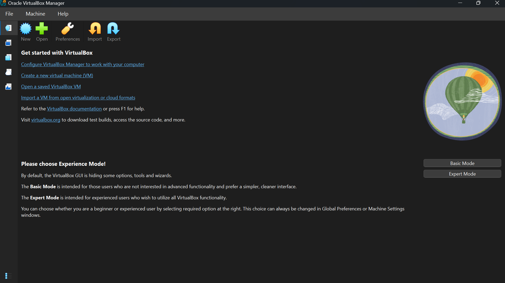
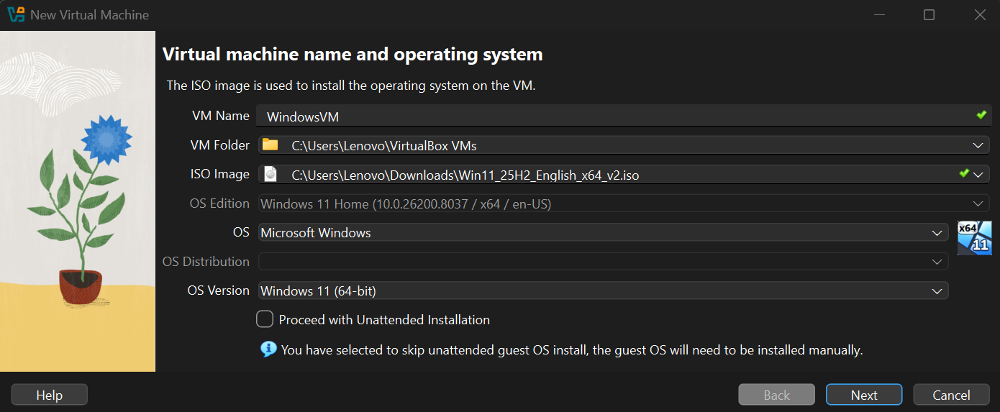
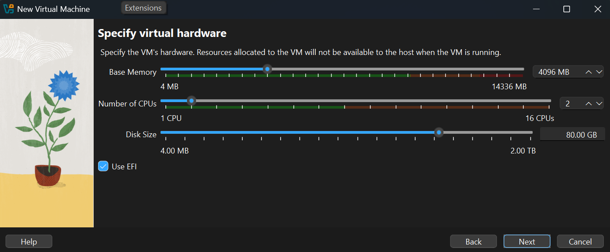

## Part 1
# 1.0 \\\ Setting up a defender Virtual Machine
### 1.1 \\\ Download VirtualBox.  This will be used to create our defender/attacker machines.
  * Download VirtualBox
      * Go to [VirtualBox Downloads](https://www.virtualbox.org/wiki/Downloads)
      * Download the appropriate installer(Windows x64 executable for me)
      * follow directions to install and launch
### 1.2 \\\ Download a Windows .iso file.  This will be the OS for our defender VM
   * Go to [Windows x64 .iso download](https://www.microsoft.com/en-us/software-download/windows11)
   * Download the .iso file
### 1.3 \\\ Mount the .iso file in VirtualBox to create the Windows VM
   * Launch VirtualBox. The home screen should look like this:
     
   * Select "New" in the top left to create a new VM
   * Choose a name (something like Windows Defender VM)
   * Select the Windows x64 .iso file you just downloaded in the last step
   * Uncheck "Proceed with unattended installation" if you would like to set up Windows manually or change the OS version(8-11)
   * Select "Next"
     
   * Now we have to decide how much virtual hardware we want to allocate to our VM including
    * Memory(RAM): Select 4GB(4096 MB) -- a safe amount to run the VM smoothly that won't take up too much of your hardware's RAM
    * Number of CPUs: 2 -- similarly a safe amount to both run the VM smoothlywhile not taking up too much of the host CPU allowing the host to run smoothly as well
    * Disk Size(Storage): 80GB -- enough storage to download sysmon among other blue team tools
   * Select "Next"
     
   * Proceed through the summary page to finish and create the VM.
### 1.4 \\\ Launch the VM and install Windows
   * Navigate to the "Machines" tab in VirtualBox and locate the machine you just created
   * Select the VM and hit "Start" to launch the VM
   * Follow the Windows Setup instructions to install Windows
   * Wait for Windows to fully install (This may take a looooooooong time.....)
   * Congrats! Once the download is complete you've created your first VM! :)
     * It's best practice to take an image of the VM now that we have a clean install.  This way, no matter what happens to the defender machine when exposed to threats, we have always a clean backup to return to.
       * ____show how to take image___

### 1.5 \\\ What is sysmon?
   * sysmon is a Windows security tool that monitors device and network activity and saves the activity to Windows event logs
   * sysmon logs are often integrated into a SIEM(Security Information and Event Management System) where analysts can parse logs to do advanced threat detection, monitoring, and prevention
   * We will install sysmon on our machine to ingest  and analyze logs when we expose our defender machine to threats from the attacker machine we will create later on.

### 1.6 \\\ Installing sysmon
   *
     
  
